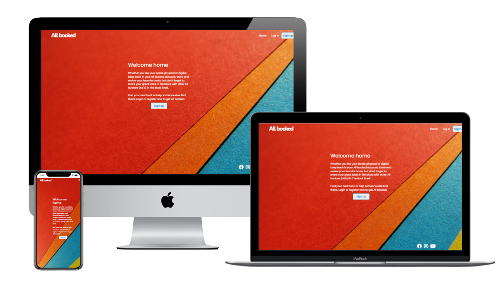
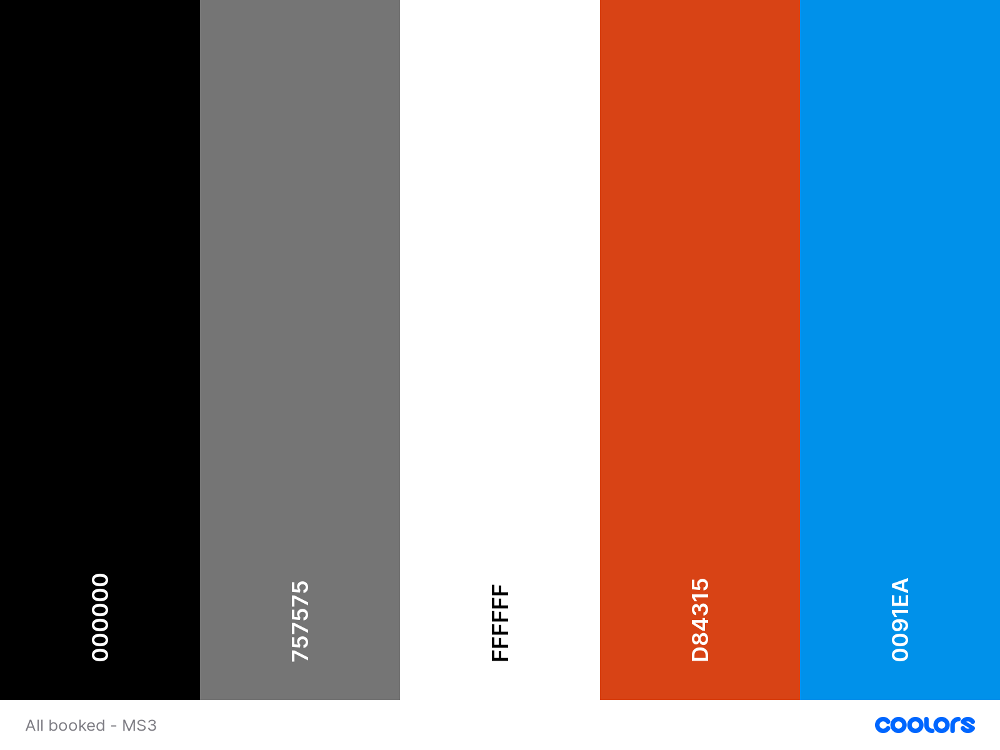

# All booked
All booked is an online platform for people who love to read. 
Our users are able to create an account that gives them access to a self curated collection of books. 
Users are able create personalised book lists that can be shared with other users. All booked stems from a book and discussion club that I used to attend.  

[Please see the deployed site on Heroku here](https://all-booked-ms3.herokuapp.com/)

[Please see the repository on github here](https://marijoke.github.io/all-booked-ms3/)

## UX
This website is for:
- People who enjoy reading books
- People who want to curate their collection
- People interested in writing notes or reviews ion the books they have read.
- People interested in getting new book recommendations.
- Companies that may want to use affiliate links for the books linked to stores. 

### Wireframes
I created wireframes using [Mockplus](https://www.mockplus.com/?home=1)

[Please see Wireframes here.](https://photos.app.goo.gl/ijiVN3WHbHJBuBJD6)

### Fonts 
The fonts chosen for the website are:
[Poppins](https://fonts.google.com/specimen/Poppins?query=popp#glyphs) was used for the body offering a Geometric sans serif typeface that is clear to read at every size.
[Nunito](https://fonts.google.com/specimen/Nunito?query=nunito#standard-styles) was used for the All booked logo. Nunito is a well balanced sans serif typeface superfamily.

### Colours
I used [Coolers](https://coolors.co/) to look up suitable colour schemes. I wanted colours that complimented each other but were also bold. My selection was limited due to using Materialize which has a selected range of colours that can be added. 

## User Stories 
- As an existing reader of books, I want somewhere I can see the books I've read in one place 
- As a potential user I want to find new books to read or add to my collection
- As a potential user I want to be able to buy a book that interests me quickly
- As a potential user I want to be able to build relationships with the people that share books via the website. 
- As a user I want something easy to use with no jargon
- As a potential user I want something that looks fun and playful

## Features
### Existing Features
- Collapsible Navigation menu – Users are able to move between pages with ease regardless of the size of their device.
- Footer – features social media links.
- Mobile First design – allows users to view the website across multiple platforms without compromising usability.
- User account - Users data are save and encrypted withing their own personal account.
- list- Users can create a list of preferred books in the account that can be edited, deleted and new ones can be added.
### Features Left to Implement
- Like/ voting abilities
- Chat integration to allow users to discuss books in one place
- Search bar that allows users to search the databas for previously seen books
- Book of the month blog 
## Technologies Used
- HTML5 
- CSS3
- Python
- Javascript
- Mongodb
- Materialize
- Flask
- jQuery
- 
- [Marterialize 1.0.0](https://materializecss.com/)
    - Used to simplify layouts and create consistency of design while enabling responsiveness. 
- [Balsamiq](https://balsamiq.com/)
    - Created Wireframes for the project prior to development
- [Github](https://github.com/) & [Gitpod](https://www.gitpod.io/)
    - Used to write, store and view code
- [Google fonts](https://fonts.google.com/)
    - Used to select fonts for the project
- [Font awesome V5.15.2](https://fontawesome.com/icons?d=gallery)
    -Used for mutiple icons throughout the site 
- [Pexels](https://www.pexels.com/)
    - Used for background picture

## Testing
My Code has been checked using:
- [Markup Validation Service](https://validator.w3.org/#validate_by_input)
- [CSS Validation Service](https://jigsaw.w3.org/css-validator/)
- Google developer tool, Lighthouse. The report for this can be found [here](https://photos.app.goo.gl/H9SSpePbkK4aVqLZ7)

My project has responded well to testing in various browsers on across multiple devices. 
- The project was tested in:
    - [Google Chrome](https://www.google.com/intl/en_uk/chrome/)
    - [Firefox](https://www.mozilla.org/en-GB/firefox/)
    - [Safari](https://www.apple.com/uk/safari/)
    - [Duck Duck go](https://duckduckgo.com/)

For more testing across multiple devices please see the [All booked gets tested](/workspace/all-booked-ms3/All-booked-gets-tested.md)

## Deployment

My project was deployed using GitHub Pages and Heroku
#### GitHub
- Logged into my account on [gitHub.com](https://github.com/)
- I located my project repository 
- Selected settings
- Selected pages on the lefthand side
- I selected Master as the source in the dropdown menu
- Pressed save
- Page is automatically refreshed 
- I return to 'Pages' where the new link is available.
- Clicking the link takes you to the deployed website. However, as it is already deployed on Heroku all you can see in the README.

Local Deployment, run using Gitpod
-	Add the Gitpod browser extension on Google chrome
-	Login to your GitHub account
-	Locate the project repository and select the green Gitpod button which will open a workspace.

### Heroku
- Logged into my account on [Heroku](https://www.heroku.com/).
- Select 'Create new app'.
- I put in the of my app and chose the region closest to me.
- In 'Settings' I selected 'Config Vars' 
- I added the details from my env.py file. This includes the IP, Port, 
Secret key, MongoDB name and URI.
- I selected the 'Deploy' option.
- Under 'Deployment method' select the GitHub option to connect to your GitHub repository.
- Select Automatic deploys from the main branch and click 'Deploy Branch'.

## Credits
### Content 
- I used [Henrique's Book world ](https://github.com/Henriqueperoni/CI-MS3-Books-World) as inspiration in regards to the layout and help make sure I was on track.
- I used the Code institute mini project tutorial and source code to help build my project
- [Readme template](https://github.com/Code-Institute-Solutions/readme-template/blob/master/README.md#existing-features) helped me write my Readme file.
### Acknowledgements
- My sister Habiba being up during the late nights when I was stressing
- Spencer the best for always being so willing to help me even when I go nuclear and lose/mess up my code. Or in this case change the whole layout. 
- The baby cat Moon who did his very best to code along even when he was more a distraction that a help.
- My cousin Nina for starting a wonderful book club named *all booked* a few years ago that I miss. 
